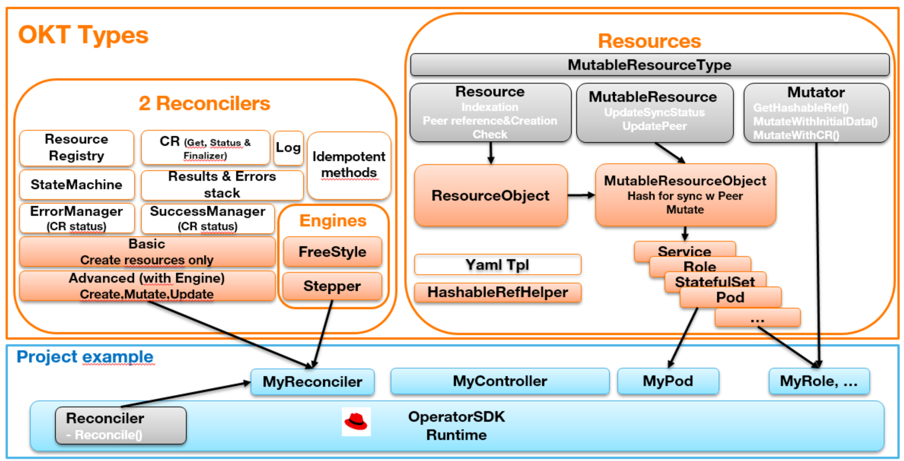
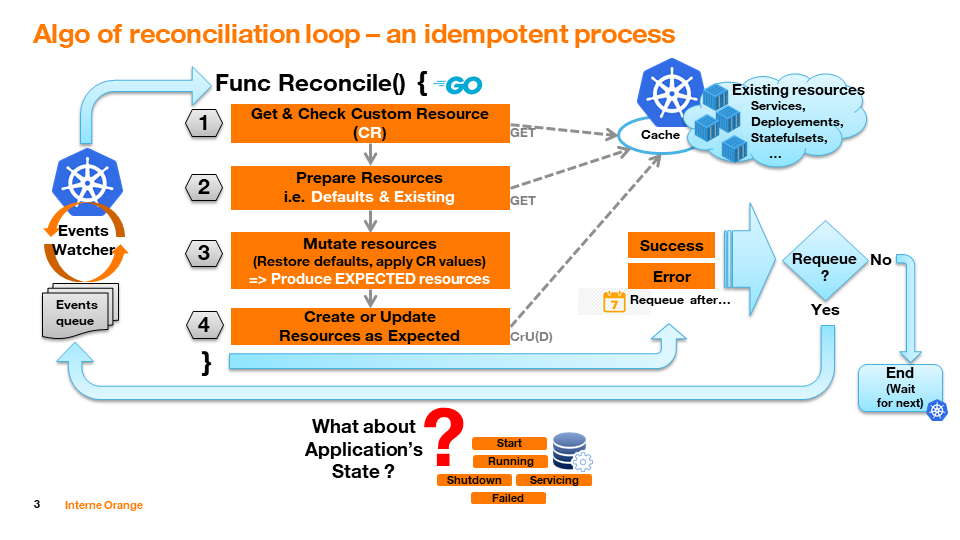
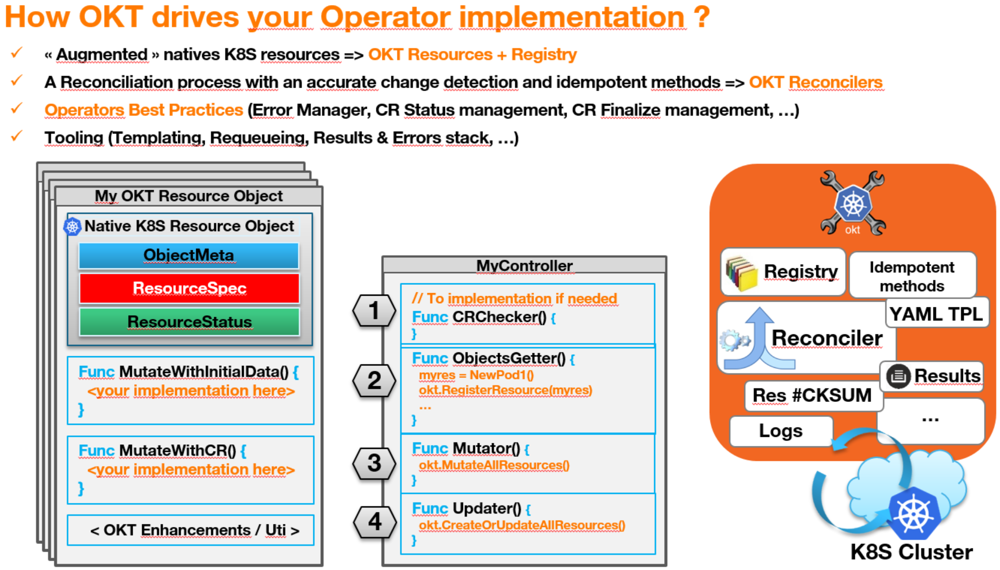

# OKT - Operators Karma Tools 

This GO toolkit is built to work in pair with [CoreOS/RedHat OperatorSDK](https://github.com/operator-framework/operator-sdk). 

OKT provides mainly a Reconciler object and resources with the aim to help the implementation of GO operators for Kubernetes.

OKT embeds several utilities or reconciliation technics found in some operators implementations in the opensource community.

OKT aims to bring some facilities (mainly a StateMachine utility) in the implementation of the application lifecycle beyond the "simple" first roll-out of resources (Phase 1 in the Capability Level diagram proposed by CoreOS/RedHat). So, OKT introduce the concept of a generic State Machine to drive an application’s lifecycle (see tools/statemachine/Readme.md).

Please go directly to [USAGE](https://github.com/Orange-OpenSource/Operators-Karma-Tools#usage) if you don't need to know how it works or see an [implementation example](https://github.com/Orange-OpenSource/Operators-Karma-Tools#operators-implementations-using-okt).

## Architecture

OKT comes with **2 Reconcilers**
  + A **Basic** one to only manage initial deployments of K8S resources
  + The **Advanced** Reconciler to go further than the initial deployement (full lifecycle)

The Advanced Reconciler can use the 2 engines:
  + **FreeStyle** - allows you to manage your reconciliation process as you want
  + **Stepper** - use a state machine (see usage or the **StateMachine** module) to guide the reconciliation process through standard practices, better errors management, CR finalization, ...

**Idempotent** methods (Create, Update) rely on a Checksum computation to determine what has changed and what to do.

OKT provides **Results** a stack of results to store errors, success information during the reconciliation process, and requeuing durations. At any time, you can get a consolidated result to return to the Controller (requeue yes or not, requeuing duration).

CR (Custom Resource) Status and Finalizer. OKT provide a native management of the **Status** for your CR through the standard way (using `metav1.Condition`). Once activated, a condition will be updated as well by the SuccessManager() and ErrorManager() methods of the Reconcilers.
If a **Finalize** information is added to your CR, OKT will tell you when the CR is being deleted and you should perform your finalizations. If you use the Stepper engine, a dedicated Step is implemented for that.

The OKT Reconcilers works with OKT Resources you defines at your end. Each OKT Resource is an extension of the K8S Resources types. As they obey to a common implementation logic allowing their mutation by the Reconciler, OKT provides a Resource code generator you have to add in your project.
**OKT Resources** are handled by the OKT Reconciler that will mutate and update them as well with intitial data after creation and CR data modifications.

Note that missing resources can be implemented easyly added by just updating a resources dictionary used by the Resource code generator.

A **Registry** is provided to register all created resource and allow the reconciler to treat them all through the idempotent methods **XxxAllResources()** (Create, Update).

**Log** - A logger is provided to trace executions and errors, with a control on the log level.

## Reconciliation in K8S

The reconciliation of K8S resources is done thought an idempotent process that tends to converge to the expected state. 

**The full story [HERE](doc/reconciliation.md)**

Each GO reconciliation function is part of a loop managed by a Controller watching for events of resource modification at the K8S cluster level.

It is not unusual to terminate the reconciliation function with an error while the current state of a resource is viewed through a Cache.

Note: To answer the question of the Application's lifecycle and implement an operator with a capability level going beyond the Phase 2, OKT could provide, at a later time, some resources which should help to manage the application as a K8S resource and then to handle its reconciliation with a similar (and idempotent) process as the one we use for the K8S resources.

## What you get with OKT usage

The main purpose of OKT is to let you focus on the application's logic to operate.

+ A Reconciler (OKT Reconciler) which take place in the Controller generated with the OperatorSDK
+ A set of OKT resources strictly mapped over K8S resources made to be managed by the OKT Reconciler and providing additional features to help their mutation with idempotent methods of OKT, and more when an helper exists (like the StatefulSetHelper)
+ Some best pratices for the reconciliation process:
  + CR validation
  + Modifications with hash detection and a method to update resources
  + CR Status management
  + Deletion logic with CR finalizer
  + Smart requeuing on reccurent errors
+ An utility to store the reconciliation errors or successful operations and report them.
+ Errors management, requeueing utilities
+ Ability to create the K8S resources either natively with GO structs or with existing YAML templates
+ An approach to manage the application's lifecycle, which may help to go beyond the Phase 2 capability level (as described by RedHat)
+ BETA: Some utilities (Curl client to call external or internal APIs, Exec in containers client, ...)
+ Globally a well structured Operator in term of souce code project which should help its maintainability.
+ Standardized logs (BETA), 
+ Application's lifecyce: A StateMachine module that should help to provide a way to manage the life cycle of the operated, stateful or not, application (see tools/statemachine/Readme.md)

For more details, see Architecture paragraphe at the bottom of this page.

## Prerequisites

OKT has been tested on:

+ GO 1.17+ (below is a compilation bug with the io/fs module for testings)
+ OperatorSDK version 1.17+ 
+ Kubernetes 1.20 (1.18+ should be ok too)

## Usage

The OKT Reconciler drives the reconciliation through a Reconciler Engine. 
OKT propose 2 engines:
  + FreeStyle engine - let you organize the way you do the reconciliation as you want
  + Stepper engine - propose a reconciliation process through several steps decribed above and in the Reconciliation doc [here](doc/reconciliation.md). It is a state machine which go to the next state only if there's no error at the current state.

OKT Operator project is Resource centric. That means that all the code you have to implement is mainly written in your OKT Resources objects.

OKT resources types are declined as follow, all are recognized in the same manner by the OKT Reconciler:

+ ResourceObject (a K8S resource, with no mutability managed by the Reconciler). Create and Delete only.
+ MutableResourceObject (a mutable K8S resource based on ObjectResource) that can be mutated and updated.

These OKT resources lead a K8S resource and obey to the OKT generic (interfaces) Resource and MutableResource.
You ca create your own application on these interfaces and let OKT Reconciler manage them as the K8S resources.

An implementation example is available through a version of the sample Memcached Operator with OKT.

### What you need to install/configure
GO (paths, ...), ...
An configured access to a Kubernetes cluster with the kubectl client (or oc)

Import in your code:

	import gitlab/<to-be-defined>/okt/<module_name>

Optionally, install the OKT CLI commands for the OKT resources code generator in $HOME/bin:

	$ git clone import gitlab/<to-be-defined>/okt.git
	$ cd okt/cli
	$ make install
	$ cd <your_operator_path>/pkg
	$ okt-gen-resource -type=<k8S-resource-type> -kind=<operator-kind> -group=<group> version=<operator-api-version> -path=<operator-path> <resource-manifest>.yaml

If you created your operator project and CRD with:
    $ operator-sdk init -project-version=1 -domain=orange.com
	$ operator-sdk add api -group=demo -version=v1alpha1 -kind=MyKind

+ kind is "MyKind" 
+ group is "demo" 
+ version is "v1alpha1"
+ type is ConfigMap, Deployment,.... (i.e. a resources belonging to the dictionary known by the command)

The list of resources known by the okt-gen-resource command is defined in its dictionary which can be completed easily (TODO: add an option to pass a dictionary file as paramter).

### What you need to replace in the Controller code generated by OperatorSDK

+ Remove the example codes and the Reconcile func, .... 
+ Add the OKT Reconciler and its engine to the Manager object. The Stepper engine is the prefered way and more advanced.

### What you need to add to the Controller

OKT reconciliation hook. In case of the Stepper engine it is a function like this:

	// EnterInState is the callback used by the Stepper engine when the Reconciliation enters in a new state
	// Note that a Giveup state is hidden here but can arise on specific GivenUp "error"
	func (r *<MyTypeReconcile>) EnterInState(engine *oktengines.Stepper) {
	        switch engine.GetState() {
	        // Main course states
	        case "CRChecker":
	                // Check my CR semanticaly
	        case "ObjectsGetter":
					var res oktres.MutableResourceObject
					var err error

	                // Create in memory all resources I need from the implementation obtained through the OKT okt-gen-resource and your own customization 
	                if res, err = NewResourceConfigMapMyData1Mutator(&r.CR, r.Client, r.CR.GetNamespace(), r.CR.Name); err == nil {
	                        r.RegisterResource(res)
	                }
					if err != nil {
						engine.Results.AddOp(res, okterr.OperationResultRegistrationAborted, err, 0)
					}
	        case "Mutator":
	                r.MutateAllResources(false)
	        case "Updater":
	                r.CreateOrUpdateAllResources(0, false)
	        case "SuccessManager":
	                r.ManageSuccess()
	        // Debranching states
	        case "CRFinalizer":
	        case "ErrorManager":
	                r.ManageError()
	        default:
	        }
	}

### Operators implementations using OKT

+ [Memcached Operator with OperatorSDK&OKT](https://github.com/tapairmax/memcached-operator-with-okt), the OperatorSDK's "Hello world!" implemented with OKT.

## Contributing 

If you find this project useful here's how you can help:

- Send a pull request with your new features and bug fixes
- Help new users with issues they may encounter
- Support the development of this project and star this repo!

## Community

If you have any questions about the NiFi operator, and would like to talk to us and the other members of the community, please send an email to the contributors.

If you find this project useful, help us:

- Support the development of this project and star this repo! :star:
- If you use OKT in a production environment, add yourself to the list of production [adopters](ADOPTERS.md). :metal:  
- Help new users with issues they may encounter :muscle:
- Send a pull request with your new features and bug fixes :rocket:

## Credits

- Implementation is based on [Operator SDK](https://github.com/operator-framework/operator-sdk)

## License

OKT is under Apache 2.0 license. See the [LICENSE](https://github.com/Orange-OpenSource/okt/blob/master/LICENSE) file for details.

    // Software Name : Operators Karma Tools
    // SPDX-FileCopyrightText: Copyright (c) 2021 Orange
    // SPDX-License-Identifier: Apache-2.0
    //
    // This software is distributed under the Apache License, Version 2.0,
    // the text of which is available at http://www.apache.org/licenses/LICENSE-2.0
    // or see the "LICENSE" file for more details.
    //
    // Author: Patrick Royer
    // Operator Karma Tools (OKT) helps Kubernetes operators implementation. Karma is a hint to the applications lifecycle.
    
